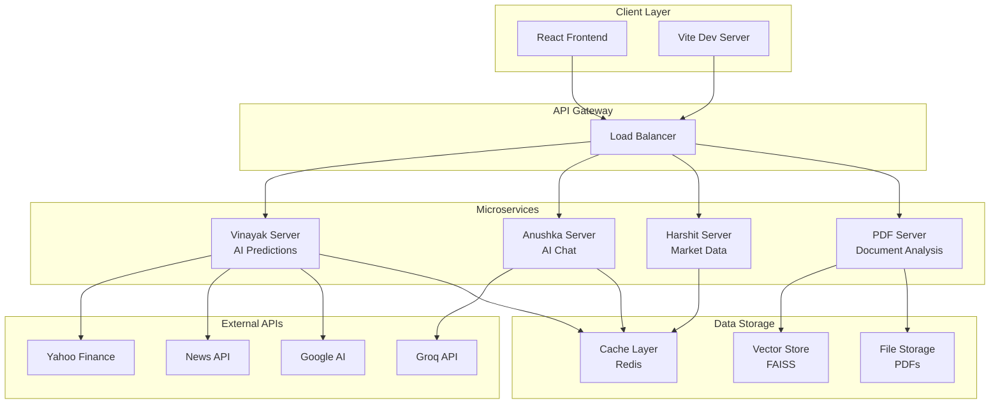
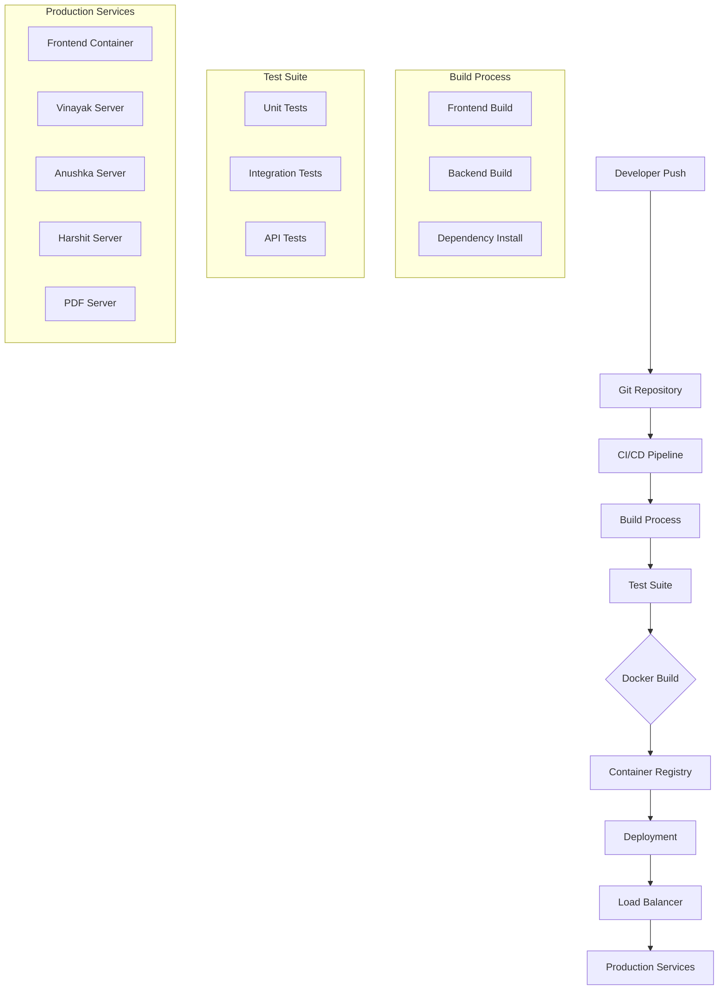
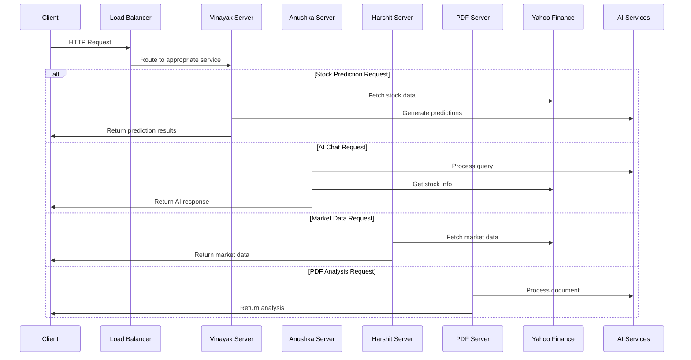
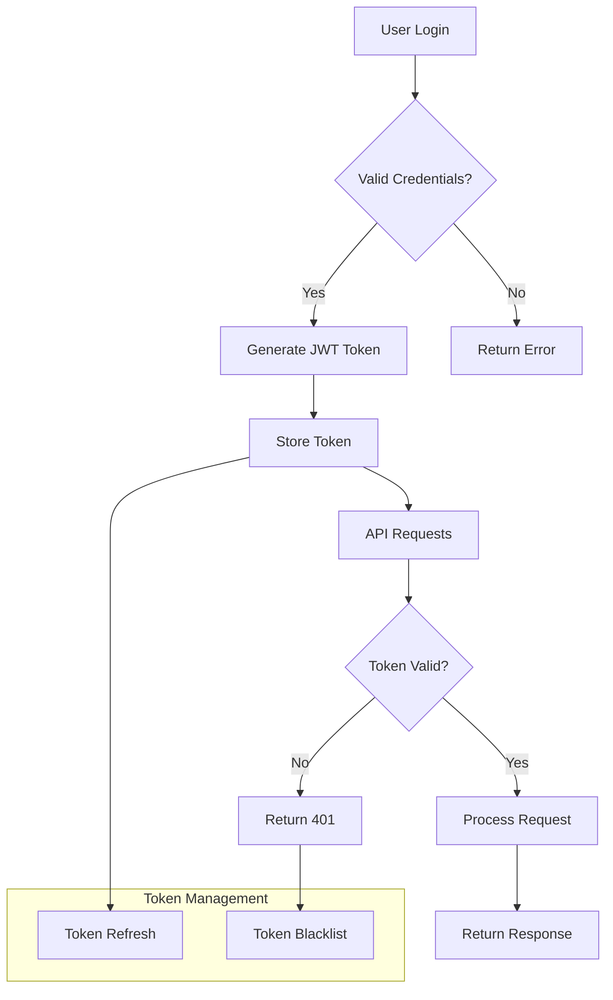
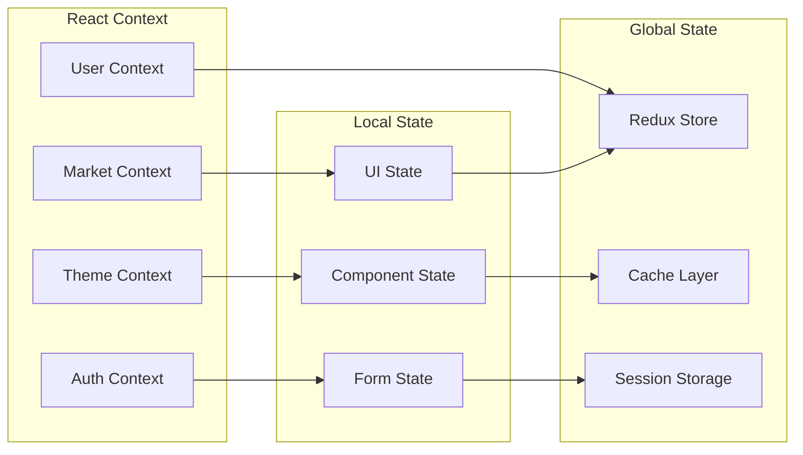
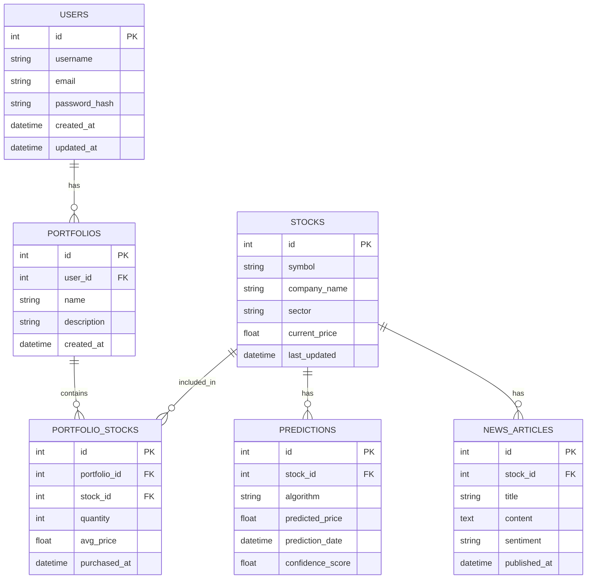
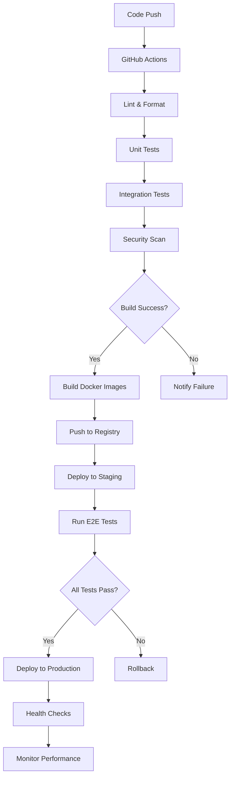
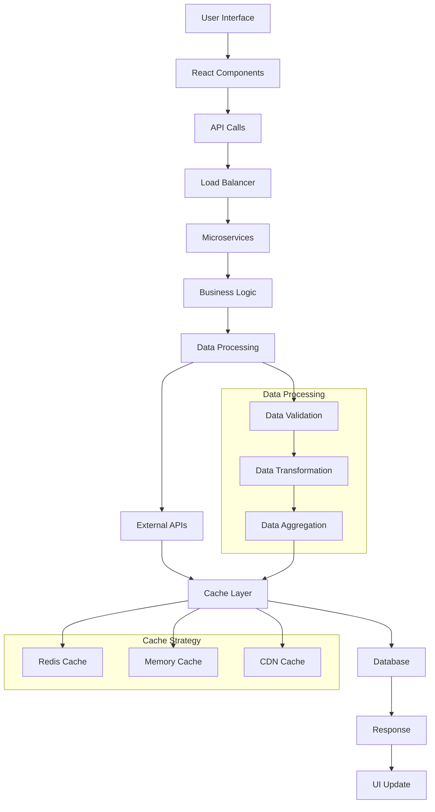

# 🚀 Init.io - Advanced Stock Analysis & AI-Powered Investment Platform

## 📋 Project Description

Init.io is a comprehensive stock analysis and investment platform that combines real-time market data, AI-powered predictions, technical analysis, and intelligent portfolio management. The platform provides users with advanced tools for stock screening, market analysis, AI-driven insights, and automated trading recommendations.

## 🎯 Problem Statement

Traditional stock analysis platforms often lack:
- **Real-time AI-powered predictions** with multiple algorithm ensembles
- **Comprehensive market sentiment analysis** from news and social media
- **Intelligent portfolio optimization** with risk management
- **Advanced technical analysis** with customizable indicators
- **PDF document analysis** for financial reports and earnings calls
- **Multi-service architecture** for scalable and maintainable development

Init.io addresses these challenges by providing a unified platform with multiple specialized microservices, each handling specific aspects of stock analysis and investment decision-making.

## ✨ Features

### 🎨 Frontend Features
- **Interactive Dashboard** with real-time market data visualization
- **Stock Screener** with advanced filtering and sorting capabilities
- **AI Chat Interface** for natural language stock queries and analysis
- **Technical Analysis Charts** with multiple timeframes and indicators
- **Market Movers** tracking top gainers, losers, and most active stocks
- **Company Details** with comprehensive financial metrics and news
- **Timeline Analysis** for historical performance tracking
- **Discovery Page** for finding new investment opportunities
- **Responsive Design** optimized for desktop and mobile devices
- **Dark/Light Theme** with customizable UI components

### 🔧 Backend Features
- **Multi-Algorithm Prediction Engine** (LSTM, XGBoost, Random Forest, ARIMA, SVR, GBM, KNN)
- **Real-time Market Data** integration with Yahoo Finance API
- **News Sentiment Analysis** using NLP and machine learning
- **Technical Indicator Calculation** (RSI, MACD, Bollinger Bands, etc.)
- **PDF Document Analysis** with RAG (Retrieval-Augmented Generation)
- **AI-Powered Stock Recommendations** using LangChain and Groq
- **Portfolio Optimization** with risk assessment
- **Market Trend Analysis** with statistical modeling
- **Automated Email Reports** and document generation
- **RESTful API** with comprehensive endpoints

## 🛠️ Technologies Used

### Frontend Stack
- **React 19** - Modern UI framework with hooks and context
- **Vite** - Fast build tool and development server
- **Tailwind CSS** - Utility-first CSS framework
- **Recharts** - Data visualization library
- **React Router DOM** - Client-side routing
- **Axios** - HTTP client for API communication
- **Lucide React** - Icon library
- **GSAP** - Animation library
- **Three.js** - 3D graphics for advanced visualizations

### Backend Stack
- **Flask** - Python web framework for microservices
- **Python 3.9+** - Core programming language
- **Pandas & NumPy** - Data manipulation and analysis
- **Scikit-learn** - Machine learning algorithms
- **TensorFlow** - Deep learning framework
- **XGBoost** - Gradient boosting library
- **Prophet** - Time series forecasting
- **YFinance** - Stock market data API
- **LangChain** - AI/LLM integration framework
- **Google Generative AI** - Advanced language models
- **Groq** - High-performance LLM inference
- **FAISS** - Vector similarity search
- **PyPDF2** - PDF processing library

### DevOps & Infrastructure
- **Docker** - Containerization
- **Docker Compose** - Multi-service orchestration
- **Git** - Version control
- **PowerShell/Bash** - Automation scripts

## 🚀 Setup Instructions

### Prerequisites
- **Node.js 18+** and **npm**
- **Python 3.9+** and **pip**
- **Docker** and **Docker Compose**
- **Git**

### Manual Setup

#### 1. Clone the Repository
```bash
git clone <repository-url>
cd Init.io_VinayakBhatia
```

#### 2. Frontend Setup
```bash
cd client
npm install
npm run dev
```

#### 3. Backend Services Setup

##### Vinayak Server (AI Predictions & Analysis)
```bash
cd vinayak_server
python -m venv myenv
source myenv/bin/activate  # On Windows: myenv\Scripts\activate
pip install -r requirements.txt
python app.py
```

##### Anushka Server (AI Chat & Stock Analysis)
```bash
cd anushka_server
python -m venv myenv
source myenv/bin/activate  # On Windows: myenv\Scripts\activate
pip install flask flask-cors python-dotenv langchain-groq yfinance
python app.py
```

##### Harshit Server (Market Data)
```bash
cd harshit
python -m venv myenv
source myenv/bin/activate  # On Windows: myenv\Scripts\activate
pip install flask flask-cors yfinance pandas numpy
python app.py
```

##### PDF Analysis Server
```bash
cd pdfff
python -m venv myenv
source myenv/bin/activate  # On Windows: myenv\Scripts\activate
pip install flask flask-cors PyPDF2 langchain-google-genai faiss-cpu python-dotenv
python app.py
```

### Docker Setup

#### 1. Create Docker Compose Configuration
```yaml
# docker-compose.yml
version: '3.8'

services:
  frontend:
    build: ./client
    ports:
      - "5173:5173"
    depends_on:
      - vinayak-server
      - anushka-server
      - harshit-server
      - pdf-server

  vinayak-server:
    build: ./vinayak_server
    ports:
      - "5000:5000"
    environment:
      - FLASK_ENV=development

  anushka-server:
    build: ./anushka_server
    ports:
      - "5001:5000"
    environment:
      - FLASK_ENV=development

  harshit-server:
    build: ./harshit
    ports:
      - "5002:5000"
    environment:
      - FLASK_ENV=development

  pdf-server:
    build: ./pdfff
    ports:
      - "5003:5000"
    environment:
      - FLASK_ENV=development
    volumes:
      - ./pdfff/uploads:/app/uploads
```

#### 2. Run with Docker Compose
```bash
docker-compose up --build
```

### Quick Start Script
Use the provided automation scripts:

**Windows (PowerShell):**
```powershell
.\start_servers.ps1
```

**Linux/macOS (Bash):**
```bash
chmod +x start_servers.sh
./start_servers.sh
```

## 📊 System Architecture



## 🔄 Deployment Flow



## 🌐 API Request Flow



## 🔐 Authentication Flow



## 🎛️ State Management Diagram



## 🗄️ Database ER Diagram



## 🔄 CI/CD Pipeline



## 📊 Data Flow (UI to DB)



## 🚀 Quick Start

1. **Clone and Setup:**
   ```bash
   git clone <repository-url>
   cd Init.io_VinayakBhatia
   ```

2. **Run All Services:**
   ```bash
   # Windows
   .\start_servers.ps1
   
   # Linux/macOS
   ./start_servers.sh
   ```

3. **Access the Application:**
   - Frontend: http://localhost:5173
   - Vinayak Server: http://localhost:5000
   - Anushka Server: http://localhost:5001
   - Harshit Server: http://localhost:5002
   - PDF Server: http://localhost:5003

## 📝 API Documentation

### Core Endpoints

#### Stock Analysis
- `GET /api/stock_data` - Get real-time stock data
- `GET /api/forecast` - Get AI-powered predictions
- `POST /api/predictions` - Generate multi-algorithm predictions
- `GET /api/technical_analysis` - Get technical indicators

#### Market Data
- `GET /api/stock-market-data` - Get market movers and indices
- `GET /api/news` - Get relevant news articles
- `GET /api/recommendation` - Get AI recommendations

#### AI Chat
- `POST /analyze` - AI-powered stock analysis
- `POST /query` - Natural language queries

#### Document Analysis
- `POST /upload` - Upload PDF documents
- `POST /query` - Query uploaded documents

## 🤝 Contributing

1. Fork the repository
2. Create a feature branch (`git checkout -b feature/amazing-feature`)
3. Commit your changes (`git commit -m 'Add amazing feature'`)
4. Push to the branch (`git push origin feature/amazing-feature`)
5. Open a Pull Request

## 📄 License

This project is licensed under the MIT License - see the [LICENSE](LICENSE) file for details.

## 🆘 Support

For support and questions:
- Create an issue in the repository
- Contact the development team
- Check the documentation in `/docs`

---

**Built with ❤️ by the Init.io Team**